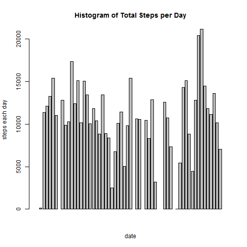
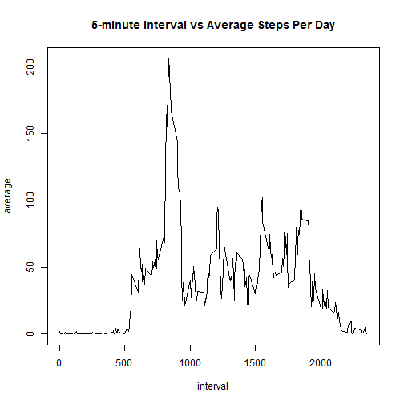
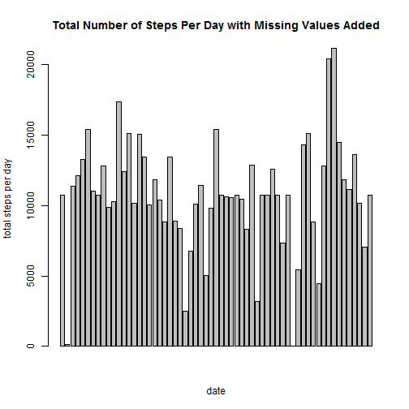
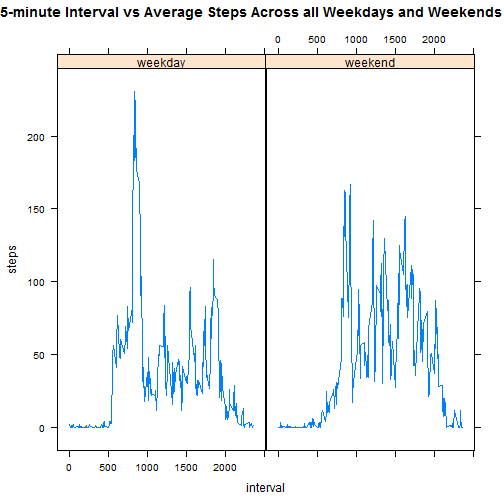

Peer Assessment 1
===================

## Set working directory.


```r
setwd("D:/Coursera/Johns Hopkins University/Data Science Specilization Certificate/5. Reproducible Research/Project 1")
```
## Loading and preprocessing the data

1. load the data 

```r
data<-read.csv("./RepData_PeerAssessment1/activity.csv")
```
2. Formating the date

```r
date1<- data$date
date <- as.Date(date1,"%Y-%m-%d")
```
## What is mean total number of steps taken per day?

1. Make a histogram of total steps taken each day:
Calculate total steps taken per day

```r
step<- with(data,tapply(steps,date,sum))
```
Create a data frame for "step"

```r
df1<- data.frame(date=names(step),steps=as.numeric(step))
```
Make a histogram for total steps each day

```r
with(df1,barplot(steps,xlab="date",ylab="steps each day",main="Histogram of Total Steps per Day"))
```

 
2. Calculate Mean and Median total number of steps each day

```r
mean(df1$steps,na.rm=T)
```

```
## [1] 10766
```

```r
median(df1$steps,na.rm=T)
```

```
## [1] 10765
```
or 

```r
summary(df1)
```

```
##          date        steps      
##  2012-10-01: 1   Min.   :   41  
##  2012-10-02: 1   1st Qu.: 8841  
##  2012-10-03: 1   Median :10765  
##  2012-10-04: 1   Mean   :10766  
##  2012-10-05: 1   3rd Qu.:13294  
##  2012-10-06: 1   Max.   :21194  
##  (Other)   :55   NA's   :8
```

## What is the average daily activity pattern?

1. Time series plot of the 5-minute interval and average steps taken.

subset data values related to the above

```r
interval<- with(data,aggregate(steps,list(interval),mean,na.rm=T))
colnames(interval)<- c("interval","average")
```
Make a time series plot for the dataset above

```r
with(interval,plot(interval,average,type="l", main="5-minute Interval vs Average Steps Per Day"))
```

 
2. which 5-minute interval contains maximum average number of steps

First, sort the dataset "interval" to a decreasing order

```r
library(plyr)
which<- arrange(interval,desc(average))
```
And then,the result is in the first row of the first column

```r
which[1,1]
```

```
## [1] 835
```
## Imputing missing values:

1. Calculate total number of missing values in the dataset "data"

```r
na<- nrow(subset(data,is.na(data$steps)))
na
```

```
## [1] 2304
```

2. Replacing the missing values with the mean value:

First,create a data frame for steps value from dataset "data"

```r
newSteps<- data.frame(data$steps)
```
Second, replace missing value with the mean value, using "tapply" function

```r
newSteps[is.na(newSteps),1]<- tapply(data$steps,list(data$interval),mean,na.rm=T)
```
3. Create a new dataset equal to the original one "data": by dding new column "newSteps" to dataset "data" with all missing values are replaced by mean values

```r
newData<- cbind(newSteps,data[,2:3])
```
Then, change column names

```r
colnames(newData)<- c("steps","date","interval")
```
Double check to make sure All missing values are replaced by mean values

```r
na<- nrow(subset(newData,is.na(newData$steps)))
na
```

```
## [1] 0
```
4. Make a histogram of the total number of steps for dataset "newData" and calculate mean and median

```r
df2<- with(newData,aggregate(steps,list(date),sum))
colnames(df2)<- c("date","steps")
```
Make a hist plot 

```r
with(df2,barplot(steps,xlab="date",ylab="total steps per day", main="Total Number of Steps Per Day with Missing Values Added"))
```

 
Calculate mean and median

```r
summary(df2)
```

```
##          date        steps      
##  2012-10-01: 1   Min.   :   41  
##  2012-10-02: 1   1st Qu.: 9819  
##  2012-10-03: 1   Median :10766  
##  2012-10-04: 1   Mean   :10766  
##  2012-10-05: 1   3rd Qu.:12811  
##  2012-10-06: 1   Max.   :21194  
##  (Other)   :55
```

```r
mean(df2$steps)
```

```
## [1] 10766
```

```r
median(df2$steps)
```

```
## [1] 10766
```
Conclusion, looks like when adding values to the missing values, the median increases slightly.

## Are there differences in activity patterns between weekdays and weekends?

1. Create a new factor variables for weekdays and weekends

```r
daytype<-data.frame(sapply(newData$date,function(date){
  if(weekdays(as.Date(date)) %in% c("Monday","Tuesday","Wednesday","Thursday","Friday")){
    date<-"weekday"
    }
  else{
    date<-"weekend"
  }
  }))
```
Combine this new column "daytype" to the dataset "newData"

```r
finaldata<- cbind(daytype,newData)
colnames(finaldata)<- c("daytype","steps","date","interval")
```
2. Make a time series plot of the 5-minute interval and average number of steps taken across all weekday days and weekend days

```r
finalsubset<- with(finaldata,aggregate(steps,list(daytype,interval),mean))
colnames(finalsubset)<- c("daytype","interval","steps")
library(lattice)
finalplot<- with(finalsubset, xyplot(steps~interval|daytype,type="l", main="5-minute Interval vs Average Steps Across all Weekdays and Weekends"))
finalplot
```

 
